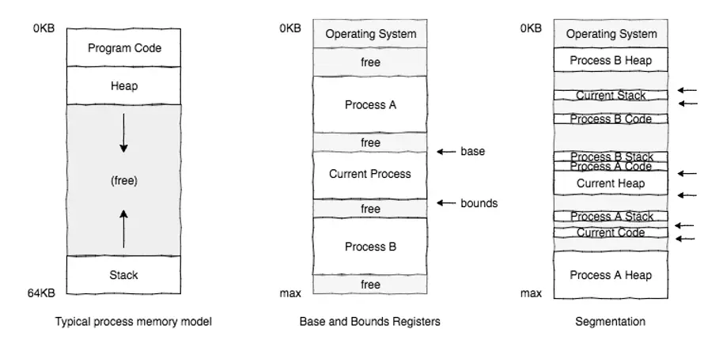
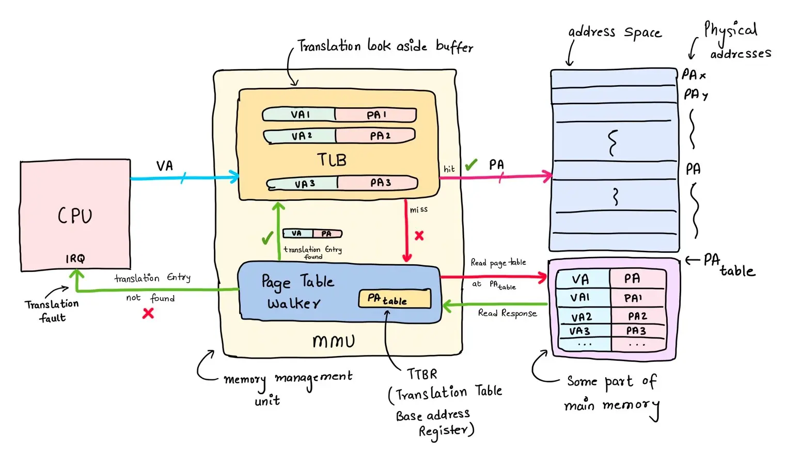
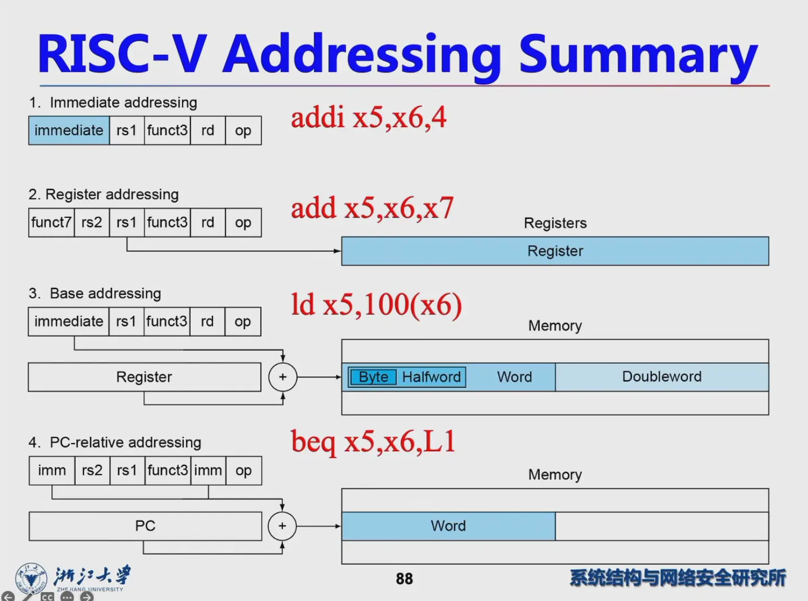
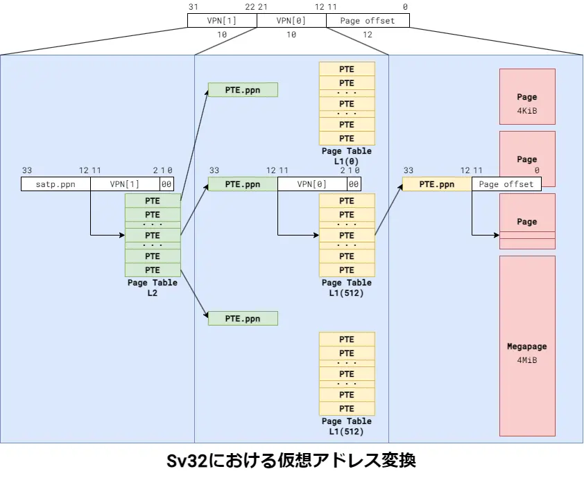
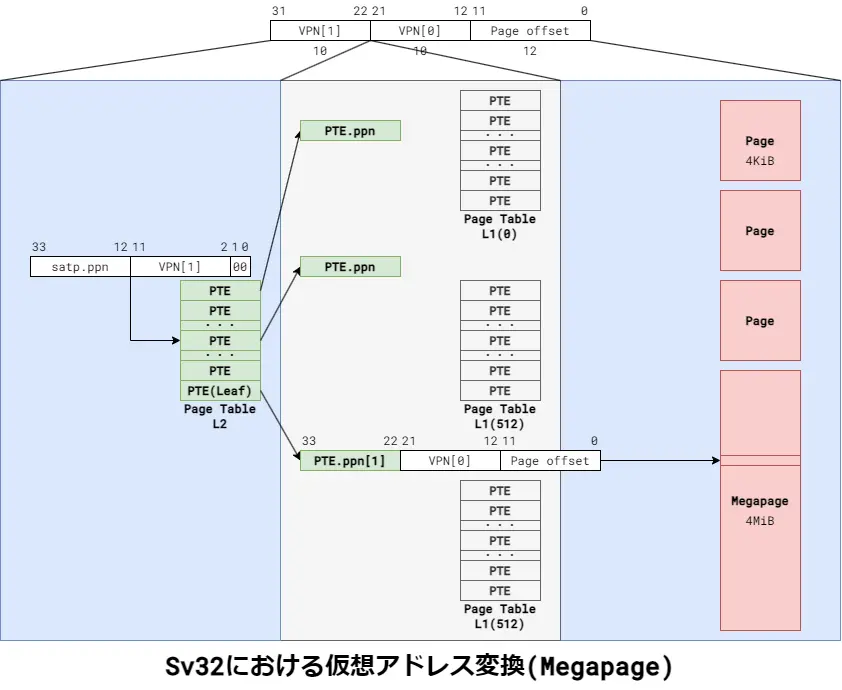
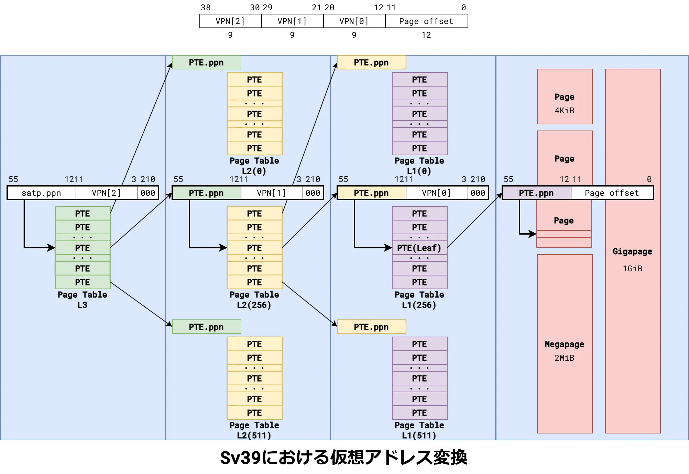
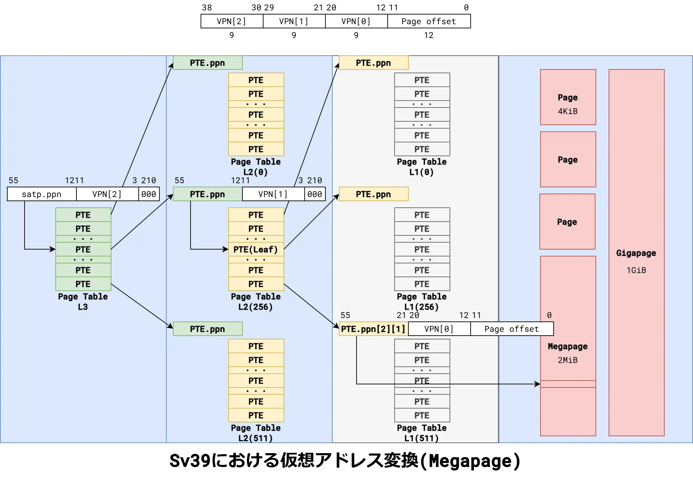
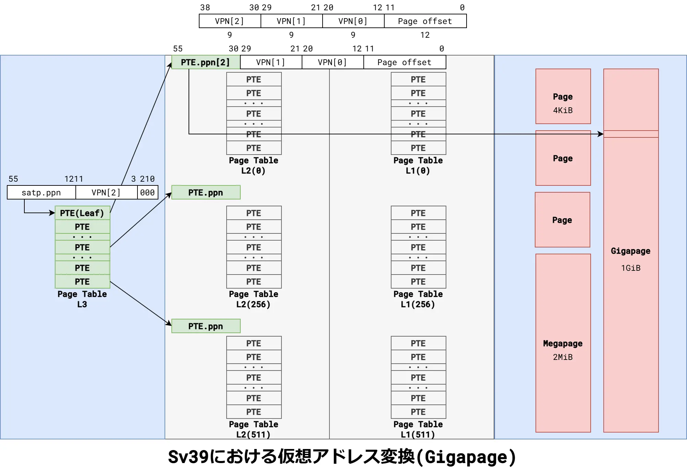
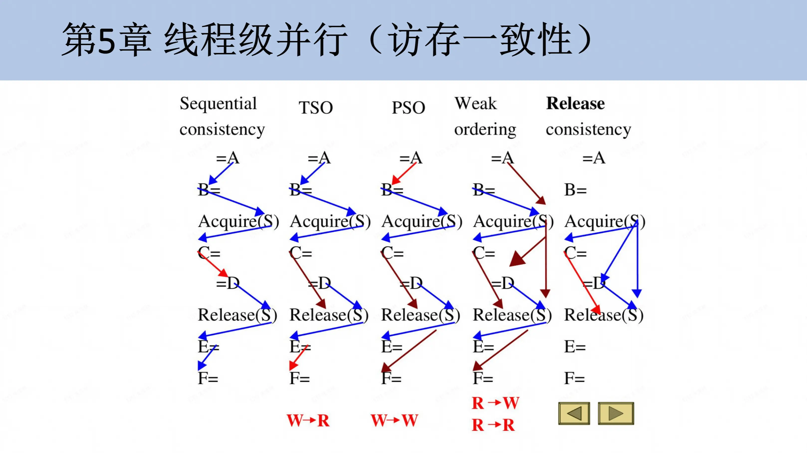

# Lab 3：Sv39 分页式虚拟内存系统

!!! danger "DDL"

    本实验文档仍在编辑中，尚未正式发布。

## 实验简介

在前两个实验中，我们的内核一直运行在**物理地址空间**中。本次实验的目标，是让内核正式进入“虚拟世界”——实现 RISC-V 的 **Sv39 分页式虚拟内存系统**。

在理论课第八、九章中，我们已经学习了虚拟内存的概念与设计思想。现在，让我们从“为什么”出发，重新理一理它的演进脉络：

- 在早期系统中，程序员需要手动管理物理内存，容易出错，也难以实现隔离和保护。
- 随着系统复杂度提升，内存管理经历了从**单一连续分配 → 静态分段（Base and Bound） → 动态分段（Segmentation）→ 分页（Paging）**的演化。每种方式都有优缺点：分段容易产生**外部碎片**，分页则可能带来**内部碎片**。

    <figure markdown="span">
        
        <figcaption>
        内存管理的发展历程<br>
        <small>图片来源：Linux Kernel Development (3rd)
        </small>
        </figcaption>
    </figure>

- 分页机制的关键思想是：**用“虚拟地址”统一抽象内存，让程序认为自己独占整个地址空间**。

实现虚拟内存需要软硬件协作，如下图所示：

<figure markdown="span">
    
    <figcaption>
    虚拟内存的软硬件协作<br>
    <small>图片来源：[Piyush Itankar on X: "Here is how MMU (memory management unit) works!"](https://x.com/_streetdogg/status/1870679201424261309)
    </small>
    </figcaption>
</figure>

- CPU 内部的 **MMU（Memory Management Unit）** 负责解析页表、执行地址转换和权限检查。我们的所有硬件都是 QEMU 模拟的，它也会实现 MMU 功能。
- 我们实现的操作系统需要负责**构建与维护页表**、**处理缺页异常**。

本实验要实现 RISC-V 规范中的 **Sv39 多级页表机制**，你将完成以下关键步骤：

1. **理解并掌握页表结构**：学习 Sv39 的三级页表格式，弄清每级索引、PTE 各字段的意义。
2. **构建内核页表**：为内核镜像的各个段（`.text`、`.rodata`、`.data`、`.bss`）建立映射，并配置正确的访问权限；同时实现内核空间的直接映射区域。
3. **切换至虚拟地址执行**：配置 `satp` 寄存器，执行 `sfence.vma`，完成从物理地址到虚拟地址的安全过渡。

完成本实验后，你的操作系统将第一次具备**完整的地址空间抽象能力**。这意味着你的内核不再依赖物理世界的直接寻址，而开始以虚拟地址的视角运行。

## 实验要求

见 [首页#要求和评分标准](index.md#要求和评分标准)

## Part 0：环境配置

### 更新代码

现在你位于 `lab2` 分支。你需要创建 `lab3` 分支，合并上游的代码：

```shell
git checkout -b lab3
git fetch upstream
git merge upstream/lab3
```

下面的合并说明供同学们解决合并冲突时参考：

- 新增实验相关：
    - 虚拟内存代码 `mm.h`
- 变更：
    - `vmlinux.lds`：链接器脚本修改，其中 `_sbss` 移动到 `.bss` 段最开始的位置（因为待会要用），现在不是栈底了。重新弄了俩符号 `_sstack` 和 `_estack` 作为内核栈的边界。之前使用 `_sbss` 作为内核栈的同学需要修改 `head.S`，而在 `head.S` 中自行定义栈边界的同学则不受影响。

## Part 1：从物理地址到虚拟地址

### 链接器脚本、虚拟地址与加载地址

同学们合并 `vmlinux.lds` 的更改时，应该注意到其中发生了这样的变更：

```diff
diff --git a/kernel/arch/riscv/kernel/vmlinux.lds b/kernel/arch/riscv/kernel/vmlinux.lds
index 6ede8c0..24c9f07 100644
--- a/kernel/arch/riscv/kernel/vmlinux.lds
+++ b/kernel/arch/riscv/kernel/vmlinux.lds
@@ -7,12 +7,15 @@ PHY_SIZE     = (128 * 1024 * 1024);
 PHY_END      = (PHY_START + PHY_SIZE);
 PGSIZE       = 0x1000;
 OPENSBI_SIZE = (0x200000);
+VM_DIRECT_START = 0xffffffd600000000;
+VM_DIRECT_END = (VM_DIRECT_START + PHY_SIZE);
 
 MEMORY {
     ram  (wxa!ri): ORIGIN = PHY_START + OPENSBI_SIZE, LENGTH = PHY_SIZE - OPENSBI_SIZE
+    ramv (wxa!ri): ORIGIN = VM_DIRECT_START + OPENSBI_SIZE, LENGTH = PHY_SIZE - OPENSBI_SIZE
 }
 
-BASE_ADDR = PHY_START + OPENSBI_SIZE;
+BASE_ADDR = VM_DIRECT_START + OPENSBI_SIZE;
 
 SECTIONS
 {
@@ -28,7 +31,7 @@ SECTIONS
         *(.text .text.*)
 
         _etext = .;
-    } AT>ram
+    } >ramv AT>ram
 
     .rodata : ALIGN(0x1000) {
         _srodata = .;
```

合并后，请编译内核，并观察上述修改引起的变化：

- **修改**：`BASE_ADDR` 从物理地址 `0x80000000` 变为虚拟地址 `0xffffffd600000000`。

    **变化**：打开 `System.map`，看看内核符号们的地址发生了什么变化？

    所有符号的地址都从原来的 `0x80000000` ~ `0x9fffffff` 变为 `0xffffffd600000000` ~ `0xffffffffffffffff`。精确地说，变化后的地址 = 原地址 + `0xffffffd600000000` - `0x80000000`。调试遇到困难时，要记得可以通过这一关系换算地址。

- **修改**：各 Section 的地址发生了变化，相关的链接器脚本语法见 [3.6.8.2 Output Section LMA - LD](https://sourceware.org/binutils/docs/ld.html#Output-Section-LMA-1)。

    > Every section has a virtual address (VMA) and a load address (LMA); see Basic Linker Script Concepts. The virtual address is specified by the see Output Section Address described earlier. The load address is specified by the AT or AT> keywords. Specifying a load address is optional.
    >
    > The AT keyword takes an expression as an argument. This specifies the exact load address of the section. The AT> keyword takes the name of a memory region as an argument. See MEMORY Command. The load address of the section is set to the next free address in the region, aligned to the section’s alignment requirements.

    **变化**：链接器在执行符号解析、重定位等链接操作时，现在会使用 VMA 地址（虚拟地址），而在生成最终的内核镜像时，仍然使用的是 LMA 地址（物理地址）。

    这意味着内核镜像仍然会被加载到 `0x80000000` 开始的物理内存中。

    !!! example "动手做：验证内核加载的仍是物理地址"

        动手调试一下刚编译的内核：

        - 在 `0x80200000` 处打断点，让 GDB 运行到断点处停下来；
        - 你会发现 GDB 现在没法解析源码位置（比如断点处停下来的时候显示 `0x80200000 in ??()`）。这是因为 GDB 是根据符号的位置来推算当前位于哪个函数的，现在所有符号都变成了虚拟地址，它现在找不到 `0x80200000` 对应哪个函数；
        - 使用 GDB 或 QEMU Monitor，将从 `0x80200000` 开始的内存打印为指令，与 `vmlinux.asm` 中的反汇编结果对比，它们是否一致？

### 寻址方式

在刚才的动手做中，你应该发现了结果存在一些不一致。这里以 `mm_init()` 函数的调用为例：

```text title="vmlinux.asm 中的反汇编结果"
    call mm_init
ffffffd600200018: 3f9000ef           jal ffffffd600200c10 <mm_init>
```

```text title="GDB 中的反汇编结果"
(gdb) x/10i 0x80200018
   0x80200018:  jal     0x80200c10
(gdb) x/10xw 0x80200018
0x80200018:     0x3f9000ef
```

`objdump` 反汇编结果显示 `jal` 指令跳转到 `0xffffffd600200c10`，而 GDB 显示跳转到 `0x80200c10`。但是，两边的机器码都是 `0x3f9000ef`，说明它们实际上是同一条指令。你能解释这是为什么吗？

!!! example "动手做：解释同一条指令的不同翻译结果"

    提示：

    - 把机器码（用你自己的机器码，和文档不一定相同）输入到 [rvcodec.js · RISC-V Instruction Encoder/Decoder](https://luplab.gitlab.io/rvcodecjs/) 中，看看解码出来是什么。
    - `jal` 指令的寻址方式是什么？
    - 在 `vmlinux.asm` 和 GDB 中，**当前指令地址（PC）**分别是什么？你能算算跳转目标地址是否和翻译结果一致吗？

再看看其他指令。在 Lab1 中我们设置了栈，一般是通过 `la` 某个符号地址实现的，看看看它翻译成了什么：

```text title="vmlinux.asm 中的反汇编结果"
    /* Lab1 Task1 */
    # need to setup sp for C function
    # s0 is callee-saved, so we can use it as a temporary register
    la sp, _estack
ffffffd600200004: 00009117           auipc sp,0x9
ffffffd600200008: ffc10113           addi sp,sp,-4 # ffffffd600209000 <kthread_create_info_cache>
```

通过上述探究，同学们应该能想起《计算机组成》课上学习过的 RISC-V 寻址方式：

<figure markdown="span">
    
    <figcaption>
    RISC-V 的寻址方式<br>
    <small>图片来源：《计算机组成》课程 PPT</small>
    </figcaption>
</figure>

现在我们知道，链接器在解析函数、全局变量等符号时，使用的都是 PC 相对寻址。记住这一点，它为下文的重定位奠定了基础。

### 虚拟与物理地址的转换

需要注意的是，有些地方仍然使用物理地址。例如：

- `sbi_debug_console_write()` 函数仍然接收物理地址参数
- Buddy System 仍然使用物理页帧（PFN）管理内存
- 下文学习的 SATP、PTE 中的 PPN 也是物理页号

这些位置使用 `VA2PA`、`PA2VA` 等宏进行转换。在合并、编写代码时，请务必区分清楚虚拟地址与物理地址，避免混淆。

## Part 2：构造 Sv39 页表

### RISC-V Sv39 规范阅读

本节要求同学们**完整阅读**特权级手册中的以下两节：

- [12.3. Sv32: Page-Based 32-bit Virtual-Memory Systems](https://zju-os.github.io/doc/spec/riscv-privileged.html#sv32)
- [12.4. Sv39: Page-Based 39-bit Virtual-Memory System](https://zju-os.github.io/doc/spec/riscv-privileged.html#sv39)

!!! warning "不可跳过规范阅读"

    Sv39 是分页机制的核心，**历年考试几乎必考**。不读标准，你会在位宽、权限位、翻译流程上出现理解偏差。请务必认真通读并结合图表理解。

导读：

- 阅读目标是掌握 RISC-V 的**虚拟地址结构、页表层级与翻译算法**。阅读 **Sv32 了解机制**，阅读 **Sv39 明确差异**。
- **Sv32** 是给 32 位系统设计的，它详细描述了“地址翻译的全过程”，是学习流程的**模板**。
- **Sv39** 面向 64 位系统，只在 Sv32 的基础上说明“有何不同”，例如：

    - 页表层级从 2 级变为 3 级；
    - 虚拟地址长度从 32 位变为 39 位；
    - 页表项（PTE）扩展为 8 字节；
    - 支持 2 MiB、1 GiB 的大页（megapage/gigapage）。

阅读过程中画图是一个很好的习惯。下面这些图来自 [RISC-V Sv32,Sv39 を理解する](https://vlsi.jp/UnderstandMMU.html)，有助于同学们理解 Sv32/Sv39 的各种页类型与地址转换流程：

<figure markdown="span">
    <div style="display:flex; gap:8px; align-items:flex-start;">
        
        
    </div>
    <figcaption>
    Sv32 地址转换与 2MiB 大页<br>
    <small>[RISC-V Sv32,Sv39 を理解する](https://vlsi.jp/UnderstandMMU.html)
    </small>
    </figcaption>
</figure>

<figure markdown="span">
    <div style="display:flex; gap:8px; align-items:flex-start;">
        
        
        
    </div>
    <figcaption>
        Sv39 地址转换与 2MiB、1GiB 大页<br>
        <small>[RISC-V Sv32,Sv39 を理解する](https://vlsi.jp/UnderstandMMU.html)</small>
    </figcaption>
</figure>

??? note "要点：Sv39 分页虚拟内存系统"

    | 类别 | 关键要点 |
    | --- | --- |
    | **地址结构** | Sv39 虚拟地址 39 位：VPN[2:0] 各 9 位，页内偏移 12 位。<br>CPU 访问时检查符号扩展：bit 63–39 必须与 bit 38 相同。 |
    | **页表结构** | 三级页表，每层 512 项、每项 8 B。<br>页表页大小 4 KiB；根页物理基址在 `satp.PPN`。 |
    | **页表项（PTE）格式** | 低 10 位含 V/R/W/X/U/G/A/D；其余为 PPN。<br>R=0 且 W=1 非法；A/D 由硬件在访问时更新。 |
    | **树形结构** | 叶子表项：R/W/X 任一为 1。<br>中间表项：V=1 且 R/W/X=0。 |
    | **权限控制** | V：有效位。<br>R/W/X：读/写/执行许可。<br>U：用户可访问。<br>G：全局映射。<br>A/D：访问/修改标记。<br>非法组合会触发页错误。 |
    | **地址转换流程** | 自 `satp.PPN` 逐级索引：VPN[2] → VPN[1] → VPN[0]。<br>遇叶子即停止；无效/越权/未对齐触发页错误。 |
    | **关键寄存器** | `satp.MODE`=8：Sv39。<br>`satp.ASID`：区分地址空间。|
    | **关键指令** | `sfence.vma`：刷新 TLB，避免旧映射。 |
    | **访存行为控制** | `sstatus.SUM`：允许内核访问 U=1 页。<br>`sstatus.MXR`：允许从可执行页读。 |

### 内存屏障与 TLB、缓存刷新

刚才阅读的章节末尾有这么一段话：

> Note that writing satp does not imply any ordering constraints between page-table updates and subsequent address translations, nor does it imply any invalidation of address-translation caches. If the new address space’s page tables have been modified, or if an ASID is reused, it may be necessary to execute an SFENCE.VMA instruction (see Section 12.2.1) after, or in some cases before, writing satp.

本节就来看看 `sfence.vma`。请同学们阅读特权级手册中的 [12.2.1. Supervisor Memory-Management Fence Instruction](https://zju-os.github.io/doc/spec/riscv-privileged.html#sfence.vma) 的**前两段内容（包括注释）**。阅读时，你需要回忆**《计算机组成》中学习的 TLB、《计算机体系结构》中学习的缓存一致性**等相关知识。

导读：

- > The supervisor memory-management fence instruction SFENCE.VMA is used to synchronize updates to in-memory memory-management data structures with current execution. Instruction execution causes implicit reads and writes to these data structures; however, these implicit references are ordinarily not ordered with respect to explicit loads and stores.

    这里的 in-memory memory-management data structures 指的就是**放在内存中的页表**。

- > The SFENCE.VMA is used to flush any local hardware caches related to address translation. It is specified as a fence rather than a TLB flush to provide cleaner semantics with respect to which instructions are affected by the flush operation and to support a wider variety of dynamic caching structures and memory-management schemes. SFENCE.VMA is also used by higher privilege levels to synchronize page table writes and the address translation hardware.

    这里解释了 `sfence.vma` 为什么被设计成内存屏障（fence）而不是简单的 TLB 刷新指令。《计算机体系结构》课上我们学习了 CPU 在 L1 会有 i Cache 和 d Cache，这同样涉及虚拟内存。`sfence.vma` 的语义更宽泛，能够**涵盖所有与地址转换相关的缓存结构**。

- 该节剩余的部分涉及《计算机体系结构》中的内存一致性模型（RVWMO，对应体系结构课上学习的 Weak Ordering）。内存一致性在体系结构中也算比较难的内容，这里就不展开了。感兴趣的同学可以自行阅读，在报告中讲讲你读完后觉得 `sfence.vma` 有什么有意思的地方。这里提供一篇参考资料：[细说 RVWMO：RISC-V 指令集手册 Appendix A（一） - 知乎](https://zhuanlan.zhihu.com/p/677678235)。

    <figure markdown="span">
        
        <figcaption>
        内存一致性模型概览<br>
        <small>图片来源：《计算机体系结构》课程 PPT
        </small>
        </figcaption>
    </figure>

### 内核内存布局

RISC-V 架构下的 Linux 内核的内存布局见 [Virtual Memory Layout on RISC-V Linux — The Linux Kernel documentation](https://docs.kernel.org/arch/riscv/vm-layout.html)。我们采取简化的模型。

- **内核与用户空间：**

    同学们已经了解到，Sv39 分页式虚拟内存系统中，64b 的虚拟地址实际有效的只有 39b，其余高位必须与 bit 38 保持符号扩展一致。这意味着整个 $2^{64}\text{B}$ 的地址空间被划分为两个对称的区域：

    - **用户空间**：`0x0000000000000000` ~ `0x0000003fffffffff`（低地址半区）
    - 无效地址：多达 16M TB。
    - **内核空间**：`0xffffffc000000000` ~ `0xffffffffffffffff`（高地址半区）

    在本实验中，我们只实现内核空间的映射，用户空间的映射将在 Lab4 实现。

- **内核空间：**

    Linux 的内核空间布局较为复杂，包含设备 I/O、内核堆栈等区域，我们全部弃用。本实验只实现直接映射，也就是将 Lab2 中介绍的从 `0x80000000` 开始的物理内存全部映射到 `0xffffffd600000000` 开始的虚拟地址空间。

### 重定位

内核启动初期运行在物理地址上，它要怎么切换到虚拟地址空间呢？

最重要的问题是 PC 要从物理地址跳转到虚拟地址。回忆目前为止学习的所有 RISC-V 知识，有哪些地方可以修改 PC？

- 跳转：`jal`、`jalr`、`ret` 指令（本质上是 `jalr`）
- Trap：陷入、xRET 返回

Linux 选择了通过 Trap 实现，留给同学们探究。这里介绍一下通过跳转实现重定位的思路：

- 写一个汇编函数 `relocate()`
- 在其中给**某些寄存器**加上偏移量 `PA2VA_OFFSET`
- `ret` 返回，PC 和**某些寄存器**就完成了重定位，切换到了虚拟地址
- 因为函数、全局变量都是 PC 相对寻址的，所以整个内核镜像都完成了重定位

这里的**某些寄存器**请同学们自己思考。

!!! example "动手做：中断实现重定位"

    阅读 Linux 内核源码 [`arch/riscv/kernel/head.S`](https://github.com/torvalds/linux/blob/master/arch/riscv/kernel/head.S) 的 `relocate_enable_mmu()` 函数，解释它是怎么实现重定位的。

    完成 Task 1 后，请你分析这两种重定位方式是否都需要恒等映射？为什么？

### Task 1：大页表双重映射

!!! tip "术语：映射"

    **映射（mapping）**：将虚拟地址空间的一段连续区域对应到物理地址空间的一段连续区域的过程。

    在 RISC-V 中，映射是通过页表实现的。页表将虚拟地址转换为物理地址，并提供权限控制。

    所以，当我们说“建立映射”时，实际上是指**在页表中创建相应的页表项（PTE）**，以实现虚拟地址到物理地址的转换。

`setup_vm()` 用于构造内核启动初期的页表 `early_pg_dir`。这是一个仅有 Gigapage 的 Sv39 页表，其中包含两个映射关系：

- 恒等映射：虚拟地址 `0x80000000` ~ `0x9fffffff` 映射到物理地址 `0x80000000` ~ `0x9fffffff`；
- 内核映射：虚拟地址 `0xffffffd600000000` ~ `0xFFFFFFD61FFFFFFF` 映射到物理地址 `0x80000000` ~ `0x9fffffff`。

你的任务是：

- 在 `setup_vm()` 中，完成对 `early_pg_dir` 的初始化，建立包含上述映射关系的大页表。

    该函数的返回值是待写入 `satp` 寄存器的值，也就是说它可以这么用：

    ```assembly
    call setup_vm
    csrw satp, a0
    ```

    选择让 `setup_vm()` 返回 `satp` 值，是因为在 C 语言中用运算符构造 `satp` 的值会比写汇编更方便一些。请同学们善用头文件中提供的宏 😉。

- 在 `head.S` 中，调用 `setup_vm()`，然后用汇编开启 Sv39 分页虚拟内存。
- 在 `head.S` 中实现 `relocate()` 汇编函数，完成重定位。具体实现方式自由选择，跳转或模仿 Linux 的 Trap 方式都行。

你需要想清楚下列问题：

- 要映射的区域大小是多少？Gigapage 大页的大小是多少？你需要创建多少个页表项？

!!! success "完成条件"

    - 开启虚拟内存后没有异常，内核和 Lab2 一样正常运行
    - 写入 SATP 寄存器后，QEMU Monitor 能够正确执行下面的指令：

        ```text
        (qemu) gva2gpa 0x80000000
        gpa: 0x80000000
        (qemu) gva2gpa 0xffffffd600000000
        gpa: 0x80000000
        ```

    - 通过 Lab3 Task1 测试

### Task 2：多级页表和重定位

刚才实现的页表比较粗暴：

- 用 Gigapage 粗粒度地映射了整片空间
- 没有完全切换到虚拟地址空间，仍能通过恒等映射访问物理地址

但通过刚才的简单页表，我们成功切换到了虚拟地址空间，现在 Buddy System 返回的内存就都是虚拟地址了。有了 Buddy System 的支持，我们就可以构造更精细的多级页表映射了。

你的任务是：

- 补全 `setup_vm_final()`

    该函数构造 Sv39 三级页表 `final_pg_dir`，并返回待写入 `satp` 寄存器的值。

    该页表需要为 `vmlinux.lds` 中定义的各个段建立映射关系，权限请根据存放的内容设置：

    - `.text`：代码
    - `.rodata`：只读数据
    - `.data` 与 `.bss`：读写数据

    要求该函数调用 `create_mapping()` 来完成具体的映射工作。

- 补全 `create_mapping()`

    该函数负责在给定的页表中，建立从 `pa` 到 `va` 的映射，长度为 `size` 字节，权限为 `perm`。

    该函数有非常多种实现方法：

    - 单层循环
    - 多层循环
    - 递归

    请自由发挥。

- 在 `head.S` 中，调用 `setup_vm_final()`，然后用汇编切换到最终的页表 `final_pg_dir`。

!!! success "完成条件"

    - 开启虚拟内存后没有异常，内核和 Lab2 一样正常运行
    - 写入 SATP 寄存器后，QEMU Monitor 能够正确执行下面的指令：

        ```text
        (qemu) gva2gpa 0x80000000
        gpa: 0x80000000
        (qemu) gva2gpa 0xffffffd600000000
        gpa: 0x80000000
        ```

    - 通过 Lab3 Task2 测试。

## 扩展阅读：QEMU 和 Linux 的页表相关实现

本节我们研究一个问题：修改 `satp` 寄存器和 `sfence.vma` 这两个操作的先后顺序应该是怎样的？

- [SFENCE.VMA Before or After SATP Write · Issue #226 · riscv/riscv-isa-manual](https://github.com/riscv/riscv-isa-manual/issues/226)

TODO
