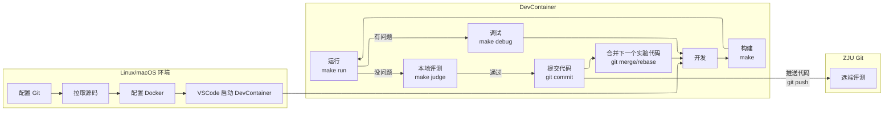

# 实验流程及工具讲解

!!! quote

    <div align="center" style="font-size:32px;">
        工欲善其事，必先利其器。
    </div>

在计算机专业的学习中，这句古话同样适用。遗憾的是，许多同学在面对 Git、Linux、Docker、GDB、VSCode 等工具时，往往缺乏系统的了解与实践经验。理论课教会了我们操作系统的核心原理，但在实践环节，许多人却被这些基础工具绊住了脚步。

**然而，这些工具不仅仅是完成实验的必需品，更将伴随你整个职业生涯**——无论是做科研、实习还是未来的工程工作，都会频繁地与它们打交道。掌握它们，就像为未来打开了一把万能钥匙。

为了帮助大家更顺利地完成《操作系统》课程的实验，也让你们能更自信地迈向后续的学习与工作，我整理了本篇文档，对实验所需的工具进行详细的讲解与串联，涵盖从环境搭建到调试的完整流程。同时，我还为这篇文章录制了配套的讲解视频，方便大家边看边操作，循序渐进地掌握每一个环节。

!!! note ""

    <div style="position: relative; width: 100%; padding-bottom: 56.25%; height: 0; overflow: hidden;">
        <iframe src="//player.bilibili.com/player.html?isOutside=true&aid=115316902334483&bvid=BV1jfxbzdEGj&cid=32842711718&p=1"
            style="position: absolute; top: 0; left: 0; width: 100%; height: 100%;"
        frameborder="no" allowfullscreen="true" scrolling="no"></iframe>
    </div>

## 实验流程概览

在正式开始实验之前，我们需要先理清整个开发与调试的流程。操作系统实验大致分为两个阶段：

1. **本地环境准备**：在自己的电脑上完成 Git 配置、源码拉取以及安装 Docker 容器平台。这一阶段的目标是确保大家能在本地顺利启动课程提供的统一实验环境，避免因为不同操作系统、依赖版本等差异导致的**环境问题**。

2. **在容器环境中实验**：通过 IDE 提供的 DevContainer 功能进入容器环境，在里面完成代码的编写、构建、运行、调试、评测，最后提交到远端进行最终测试。容器环境免去了环境配置的烦恼，确保所有同学的环境一致，专注于实验本身。

下图展示了整个实验的流程：



在接下来的章节中，我们会逐步介绍如何完成上述每个步骤，包括必要的命令、配置方法以及常见问题的解决方案，帮助大家顺利完成从环境搭建到实验提交的完整闭环。

## 前置要求

在正式开始之前，我们默认大家已经具备以下基础技能（基于实验课前的调查问卷）：

- **拥有 Linux 或 macOS 环境**，并能完成基本的 Linux 命令行操作
- **了解 Git 和 Makefile 的基本用法**

由于篇幅限制，本文无法从「如何安装 Linux」或「如何使用 Git」这样的零基础话题讲起。如果你对其中的某些内容还不太熟悉，不必担心，我们已经为你准备了补充学习资源：

- **从未使用过 Git**：建议观看 [:simple-bilibili:【GeekHour】一小时Git教程](https://www.bilibili.com/video/BV1HM411377j/)，快速掌握版本控制的基本操作。
- **对 Makefile 完全陌生**：推荐 [:simple-bilibili:【GeekHour】20分钟Makefile光速入门教程](https://www.bilibili.com/video/BV1tyWWeeEpp)，帮助你理解实验中会用到的核心命令。
- **没有 Linux/macOS 环境**：

    - **在 Windows 上安装 WSL（官方推荐）**：参考 [安装 WSL](https://learn.microsoft.com/en-us/windows/wsl/install)，在 Windows 上搭建类 Unix 开发环境。
    - **使用虚拟机安装 Linux**：如 VMware 或 VirtualBox，适合希望完整体验 Linux 系统的同学。

如果你不具备实验条件，可以联系助教申请实验机。

## Part 1：本地环境准备

接下来的内容假设你已经有一个 Linux 或 macOS 环境。**WSL 用户请在 WSL 中操作。**

!!! failure "WSL 用户不要将代码存放在 Windows 目录下"

    WSL 用户应该了解：**Linux 和 Windows 的文件系统不同，文件权限、[换行符](https://stackoverflow.com/questions/1552749/difference-between-cr-lf-lf-and-cr-line-break-types)、链接、[大小写](https://stackoverflow.com/questions/33998669/windows-ntfs-and-case-sensitivity)等方面都存在区别。**

    虽然 WSL 将 Windows 目录挂载到了 `/mnt/c` 等路径下，但这只是为了方便文件互访。官方并不建议你将文件**存放**在一边，又在另一边**使用**。首先性能较低，其次代码仓库等对文件权限、链接等有要求的项目很容易出问题。

    请 WSL 用户在 WSL 原生的文件系统中（比如 `/home/<username>/`）存放实验文件，以避免出现各种奇怪的问题。

### Git 配置

如果你已经使用过 Git，通常会完成以下配置步骤：

- **配置 SSH 密钥：** 用于安全地拉取和推送代码。你需要在本地生成 SSH 密钥对，并将公钥添加到 Git 平台。密钥文件默认保存在 `~/.ssh` 目录下。
- **设置 Git 用户信息：** 为了正确记录提交历史，需要配置用户名和邮箱。这些信息会保存在 `~/.gitconfig` 文件中。

    ```shell
    git config --global user.name "Your Name"
    git config --global user.email "username@example.com"
    ```

如果你对这些操作没有印象，请观看上文提供的学习资源。

??? question "FAQ：Git 用户名和邮箱如何配置？"

    其实设成什么都没关系，因为仓库的地址确定，助教会去对应的仓库看你的提交。

    Git 平台（如 GitHub、GitLab、ZJU Git）会根据你 commit 中的邮箱来关联到你的账号，从而显示头像等信息。如果你想让 commit 显示正确的头像，可以将 `user.email` 设置成你在 ZJU Git 上绑定的邮箱。

!!! success "完成条件"

    Linux/macOS 环境中存在以下内容：

    - `~/.gitconfig` 文件
    - `~/.ssh` 文件夹，其中存放了 SSH 密钥对

    这些内容接下来会被容器用到，请务必确保它们存在。

### ZJU Git 源码拉取

本课程使用 [ZJU Git](https://git.zju.edu.cn/) 作为统一的代码管理平台。每位同学都需在指定仓库提交代码并完成评测。首次使用请前往[登录界面](https://git.zju.edu.cn/users/sign_in)注册账号。

!!! info "ZJU Git 使用须知"

    关于 ZJU Git 的网络，同学们需要知晓：

    - ZJU Git 目前仅面向校内服务，**仅校内 DNS 有解析记录**。如果使用校外 DNS 或校外网络，则无法访问 ZJU Git。
    - 为了保障网络安全，学校信息中心封禁了 RVPN 的 22 端口，因此仅能访问 ZJU Git 网页，无法使用命令行 Git 以 SSH 方式连接。
    - **为此，ZJU Git 开放了 2222 端口供 RVPN 用户以 SSH 方式使用。**有校外网络需求的同学请注意这一点，将链接替换为 `ssh://git.zju.edu.cn:2222/...`。

助教已为每位同学分配了私有仓库，请使用以下命令将仓库克隆到本地：

```shell
git clone git@git.zju.edu.cn:os/<学期>/<教学班>/os-<你的学号>.git
```

??? question "FAQ：克隆仓库时出错"

    同学们的网络、SSH 和 Git 配置非常多样，导致的错误也非常多样。请根据具体错误信息进行排查。

    ??? question "Failed ... via ... after ...ms"

        - 现象：

            ```console
            Failed to connect to git.zju.edu.cn port 443 via 127.0.0.1 after 0 ms: Could not connect to server
            ```

        - 原因：

            `via 127.0.0.1` 表明 Git 试图通过本地代理连接到 ZJU Git，但连接失败。请检查你的代理设置。

            代理设置除了环境变量（如 `http_proxy`、`https_proxy`）外，还可能存在于 Git 配置中，运行 `git config --list` 检查是否有错误的配置。

        - 解决办法：

            删去相关错误配置，或者正确设置代理。

    ??? question "Connection timed out"

        - 现象：

            ```console
            ssh: connect to host git.zju.edu.cn port 22: Connection timed out
            ```

        - 原因：

            如上文所述，这种情况一般出现在使用 RVPN 的同学。


        - 解决办法：

            修改 Git 链接使用 2222 端口：

            ```console
            git clone ssh://git.zju.edu.cn:2222/os/<学期>/<教学班>/os-<你的学号>.git
            ```

    ??? question "Could not resolve hostname git.zju.edu.cn"

        - 现象：

            ```console
            ssh: Could not resolve hostname git.zju.edu.cn: nodename nor servname provided, or not known
            fatal: Could not read from remote repository.
            ```

        - 原因：

            ZJU Git 仅面向校内服务，**仅校内 DNS 有解析记录**。部分同学手动将 DNS 设置为其他服务器，导致 ZJU Git 无法解析。

        - 解决办法：

            如果你在校内，将 DNS 设置为自动获取，或者手动设置为浙大校园网 DNS。

    ??? question "not a valid repository name"

        - 现象：

            ```console
            git clone git@git.zju.edu.cn:...
            fatal: remote error:
            ... is not a valid repository name
            Visit https://support.github.com/ for help
            ```

        - 原因：

            从报错可以看到是 GitHub 返回的错误，但所给的链接为 ZJU Git。这一般是 Git 配置错误导致的，运行 `git config --list` 检查是否有错误的配置。

            目前发现有错误配置如下：

            ```text
            core.sshcommand=ssh -T -p 443 -o Hostname=ssh.github.com
            ```

        - 解决办法：

            删除相关错误配置：

            ```console
            git config --global --unset core.sshcommand
            ```

!!! success "完成条件"

    - 成功将代码库克隆到 Linux/macOS 环境中。
    - 用 VSCode 打开代码库目录，接下来的操作可在 VSCode 终端中完成。

### 安装和使用 Docker

!!! info "Docker 基本概念"

    - **容器**是一种轻量级的虚拟化技术，**Docker** 是一个容器平台。容器和虚拟机都能够将应用程序及其依赖打包在一个独立的环境中运行，与宿主机隔离开来。区别在于，虚拟机需要完整的操作系统，而容器只需要包含应用程序及其依赖，**利用宿主机的内核来运行**，因此更加轻量和高效。
    - 助教将所需的环境打包成一个**容器镜像（image）**，存放到 ZJUGit 容器**注册表（registry）**。同学们从 Registry **拉取（pull）** 镜像，然后基于该镜像创建并启动一个**容器（container）**。

    这为我们带来了以下好处：

    - **简单**：
        - 同学们不用手动配环境了，只需要配 Docker。
        - 环境搞坏了就删掉重建一个新的，非常方便。
    - **隔离**：环境和宿主机隔离，不会彼此影响和污染。
    - **一致**：所有人的环境都是从同一个镜像创建的，避免了绝大多数“在我电脑上能跑”的问题。

本文仅会介绍实验中必要的 Docker 操作。如果你想学习更多，可以观看 [:simple-bilibili:【GeekHour】30分钟Docker入门教程](https://www.bilibili.com/video/BV14s4y1i7Vf)。

让我们从**安装 Docker** 开始：

- Linux 和 WSL 环境请参考 [Docker CE | ZJU Mirror](https://mirrors.zju.edu.cn/docs/docker-ce/)
- macOS 推荐使用 [Docker Desktop](https://docs.docker.com/desktop/setup/install/mac-install/) 或 [OrbStack](https://orbstack.dev/download) (可以用 [Homebrew](https://formulae.brew.sh/formula/docker) 直接安装)

成功安装并启动 Docker 后，可以运行 `docker info` 来检查 Docker 是否能正常工作。

??? question "FAQ：Cannot connect to the Docker daemon"

    - 现象：

        ```text
        Cannot connect to the Docker daemon at unix:///var/run/docker.sock. Is the docker daemon running?
        ```

    - 原因：

        Docker 的工作原理是客户端-服务器模式。在终端中执行的是 Docker CLI 客户端，它需要连接到服务器即 Docker Daemon（守护进程）来完成实际的工作，比如拉取、启动容器等。错误信息表明 Docker Daemon 没有启动。

        该问题常见于在 WSL 中初次安装 Docker Engine 的场景，此时 Docker Daemon 可能尚未自动启动。

    - 解决办法：

        - Linux：

            在现代 Linux 发行版中，一般使用 [systemd](https://www.freedesktop.org/wiki/Software/systemd/) 来管理系统服务。其中，`systemctl` 用于管理服务，`journalctl` 用于管理日志。

            ```shell
            # 检查 Docker 服务状态
            sudo systemctl status docker
            # 如果输出不是 active (running)，则启动 Docker 服务
            sudo systemctl enable --now docker
            # 如果输出是其他状态（如 failed），可以将日志信息喂给 AI 寻求帮助
            sudo journalctl -u docker --no-pager | tail -n 50
            ```

        - WSL：

            如果你运行的是较老版本的 WSL，则 systemd 可能不可用。推荐你按照 [Use systemd to manage Linux services with WSL | Microsoft Learn](https://learn.microsoft.com/en-us/windows/wsl/systemd) 的指引升级 WSL 版本，启用 systemd。

            如果你不想升级，重启 WSL 应该也能解决问题。在 Windows 终端中执行：

            ```powershell
            wsl --shutdown
            ```

            然后重新打开 WSL。

        - macOS：

            确保你启动了 [Docker Desktop for Mac](https://www.docker.com/products/docker-desktop)。

接下来用课程提供的镜像来练习一些常用的 Docker 命令：

- **镜像操作**：

    - **拉取镜像**：

        ```shell
        docker pull git.zju.edu.cn:5050/zju-cs-lab/tool/sys:latest
        ```

    - **查看本地镜像及其摘要（Digest）**：

        ```shell
        docker images --digests
        ```

        镜像由 **镜像名**（如 `git.zju.edu.cn:5050/zju-cs-lab/tool/sys`）和 **标签（tag）**（如 `:x86_64`、`:latest`）组成。助教会持续更新 `:latest` 镜像，但 **唯一能保证镜像内容一致的标识是摘要（digest）**（形如 `sha256:...`）。

        如果助教通知了镜像更新，同学们可以检查本地镜像的 digest，如果与 ZJU Git 上的 digest 不同，则说明本地镜像过期，需要重新执行 `docker pull`。

    - **删除镜像**：

        ```shell
        docker rmi <image_id>
        ```

- **容器操作**：

    - **启动并进入容器**：

        ```shell
        docker run -it --rm git.zju.edu.cn:5050/zju-cs-lab/tool/sys:latest fish
        # 命令格式
        # docker run [OPTIONS] IMAGE [COMMAND]
        ```

        这条命令会基于指定镜像创建并启动一个容器，并进入容器内的 fish 终端。

        - `--rm` 表示退出容器后自动删除它。

    - **进入运行中的容器**：

        ```shell
        docker exec -it <container_id> fish
        ```

        这条命令会进入一个已经运行的容器。

    - **查看容器**：

        ```shell
        docker ps #正在运行的
        docker ps -a #查看所有容器（包括未运行的）
        ```

    - **停止并删除容器**：

        ```shell
        docker rm -f <container_id>
        ```

- **其他常用命令**：

    - **清理无用的镜像、容器等**：

        ```shell
        docker system prune
        ```

??? question "FAQ：镜像拉取问题"

    ??? question "ZJU Git EOF"

        - 现象：

            ```text
            Error response from daemon: Get "https://git.zju.edu.cn:5050/v2/": EOF
            ```

        - 原因：

            网络问题，Docker Daemon 无法连接到 ZJU Git。这往往是由于代理设置不正确导致的。

            使用 Windows Docker Desktop 的同学反映，即使自己关闭了 Clash，代理设置也会残留在 Docker Desktop 中，运行 `docker info` 可以看到下面的内容：

            ```text
            HTTP Proxy: ...
            HTTPS Proxy: ...
            ```

        - 解决办法：

            - Windows Docker Desktop 用户：在 Docker Desktop 设置界面进入 `Resources` -> `Proxies`，打开 `Manual proxy configuration`，将所有代理设置留空，然后点击 `Apply`，重启 Docker Desktop。

!!! success "完成条件"

    - 理解容器和 Docker 是什么。
    - 成功安装 Docker，并能在终端运行 `docker info`。
    - 掌握 `run`、`ps`、`rm`、`pull` 等常用 Docker 命令。

### 使用 Docker Compose

在日常开发中，如果直接使用 `docker run` 启动容器，命令可能会非常冗长，需要手动指定镜像、端口、挂载、环境变量等参数，既不直观，也不方便维护。以本课程的实验环境为例，完整的 `docker run` 命令如下：

```shell
docker run -dit \
    --name zju-os-code \
    --hostname zju-os \
    -v "$(pwd)":/zju-os/code \
    -v ~/.gitconfig:/root/.gitconfig:ro \
    -v ~/.ssh:/mnt/host_ssh:ro \
    -w /zju-os/code \
    -e UV_LINK_MODE=copy \
    -e TZ=Asia/Shanghai \
    --init \
    git.zju.edu.cn:5050/zju-cs-lab/tool/sys:latest \
    sleep infinity
```

**Docker Compose** 提供了一种更简单的方式：只需在一个 `compose.yml` 文件里定义好服务、镜像和配置，之后用一条 `docker compose up` 命令就能启动整个开发环境。

在我们的仓库中，已经为大家准备好了 `compose.yml`，里面定义了容器的运行方式和一些必要的配置。**下面是一些重要的配置点，同学们需要知悉**：

1. **代码挂载**

    代码库会被**挂载（mount）**到容器内的 `/zju-os/code` 目录下。
    这意味着：

    - 宿主机和容器**共享同一套代码文件**，修改会实时同步。
    - 代码文件实际仍保存在宿主机上，**删除容器不会导致代码丢失**。

    这样做的好处是，大家在容器内开发时，无需担心数据持久化问题，调试体验和本地几乎一样。

2. **用户与文件权限**

    容器内默认用户是 **`root`**，而宿主机上你一般是普通用户。
    当你在容器内生成文件（比如编译产物）时，这些文件在宿主机上会显示为 `root` 所有，这可能会导致你在宿主机直接编辑或删除文件时遇到**权限不足**的问题。

    解决方法：在宿主机执行以下命令，把文件的所有者改回普通用户：

    ```shell
    sudo chown -R <username>:<username> .
    ```

    请将 `<username>` 替换为你在宿主机上的用户名。

3. **Git 和 SSH 配置映射**

    特别地，执行一些 Git 操作也会产生文件，因此会产生这样的情况：在容器内执行 Git 操作后，在宿主机执行 Git 操作遇到 Permission Denied。**所以我们将宿主机的 Git 和 SSH 配置映射到容器内，这样同学们的开发、Git 操作都在容器内进行，不用回到宿主机了。**

    为此，我们在 `compose.yml` 中做了以下处理：

    - 将宿主机的 `~/.gitconfig` 和 `~/.ssh` 挂载到容器内。

    这需要你确保你在宿主机上已经配置好 Git 用户信息和 SSH Key（见前文）。

同学们也需要了解一些常用的 Docker Compose 命令：

- **启动并进入容器**：

    ```shell
    docker compose up -d
    docker compose exec zju-os-code fish
    ```

    这两条命令会启动容器，并进入容器内的 fish 终端。

    - `-d` 表示后台运行容器。
    - `zju-os-code` 是 `compose.yml` 中定义的服务名。

- **停止并删除容器**：

    ```shell
    docker compose down
    ```

!!! success "完成条件"

    - 成功安装 Docker Compose，并能在终端运行 `docker compose version`。

进一步地，课程仓库根目录下的 `Makefile` 将常用操作包装为 Make 目标，方便运行。它会检测当前环境是否存在 `docker` 命令，如果存在就认为是宿主机，否则认为是在容器内运行。不同环境下的目标有所不同：

- **在宿主机上**
    - （默认目标）`all`：创建、启动并进入容器
    - `clean`：删除容器
    - `update`：删除并更新容器镜像
- **在容器内**
    - `all`：`clean` 并构建内核
    - `clean`：清理构建产物
    - `run`：使用 QEMU 运行内核
    - `debug`：使用 QEMU 运行内核（调试）
    - `gdb`：启动 GDB 并连接到 QEMU（与 `debug` 配合使用）
    - `judge`：运行评测
    - `format`：格式化代码，请在提交代码前运行

### 使用 IDE 拉起 DevContainer

[Development containers](https://containers.dev/) 是一个由 Microsoft 开源的项目，旨在通过 `devcontainer.json` 文件定义和配置开发容器环境。它与 Docker Compose 类似，但不用于命令行，而是专注于**开发环境的配置和集成**，目前 VSCode、CLion 等 IDE 都支持它。

在我们的仓库中，已经为大家准备好了 `.devcontainer/devcontainer.json` 文件。它会使用上一节介绍的 `compose.yml` 拉起容器环境，并自动为 IDE 执行各项配置。

非 VSCode 用户请自行查看对应 IDE 的文档：

- [Dev Containers | CLion Documentation](https://www.jetbrains.com/help/clion/dev-containers-starting-page.html)
- [Supporting tools and services | DevContainers](https://containers.dev/supporting)

下面以 VSCode 为例介绍使用流程。

- VSCode 安装 [Dev Containers 插件](https://marketplace.visualstudio.com/items?itemName=ms-vscode-remote.remote-containers)
- {==VSCode 打开实验仓库==}
- 右下角可能会出现**开发容器（Dev Container）相关的弹窗**，点击在开发容器中打开

    如果没有弹窗，则按 ++ctrl+shift+p++ 打开命令窗口，输入 `reopen` 找到 `Dev Containers: Reopen in Container` 选项，选择它

    !!! tip

        VSCode 是从当前打开的文件夹找 `.devcontainer` 的，所以请确保 VSCode 当前打开了实验仓库的根目录。

        如果选择 `Reopen in Container` 后 VSCode 弹出了选择容器之类的窗口，说明你没有打开正确的目录。请尝试关闭 VSCode 重新打开。

- VSCode 将重载窗口，启动并连接到容器，自动完成插件安装等配置步骤

    !!! tip

        右下角应该会有弹窗表示开发容器正在启动，你可以点击查看日志了解启动进度。

        如果没有你执行前述的 `docker pull` 等操作，那么 DevContainer 会拉取镜像。实验镜像比较大（约 10G），你可以结合自己的网速评估一下需要的拉取时间，耐心等待。

## Part 2：容器实验环境

现在你应该已经使用 IDE 进入了 DevContainer 环境，接下来的操作都在容器内进行。

### 源代码管理

本文档仅会介绍实验中必要的 Git 知识。如果你想深入学习 Git，可以阅读这本官方教程：英文版 [Git](https://git-scm.com/book/en/)、中文版 [Pro Git 中文版（第二版）](https://www.progit.cn/)。

#### VSCode Git 插件

推荐使用 VSCode 内置的 Git（源代码管理面板）进行相关操作，官方文档见 [Using Git source control in VS Code](https://code.visualstudio.com/docs/sourcecontrol/overview)。

此外，你还可以安装 [Git Graph](https://marketplace.visualstudio.com/items?itemName=mhutchie.git-graph) 插件来可视化地查看分支、提交等信息，进行 Git 操作。

#### Git Submodule

实验评测框架作为 Git Submodule 放置在课程代码仓库的 `autograder` 目录下，所以同学们需要了解 Submodule 的基本使用方法，详见官方教程 [Git - Submodules](https://git-scm.com/book/en/v2/Git-Tools-Submodules)。简单来说：

- Submodule 中内容作为一个独立的 Git 仓库管理，父仓库只记录 Submodule 的某个提交 ID。
- `git clone` 后还需要运行下面的命令来初始化并更新 Submodule：

    ```shell
    git submodule update --init --recursive
    ```

#### Git Merge 与 Rebase

在实验过程中，你需要不断地将上游的实验代码合并到自己的分支中。常见的做法有两种：**Merge** 和 **Rebase**。

- **Merge**：将上游分支的最新提交合并到当前分支，保留两条分支的历史记录，形成一个新的合并提交。

    ```shell
    git merge upstream/labN
    ```

- **Rebase**：将当前分支的提交“搬运”到上游分支的最新提交之后，形成一条线性的提交历史。

    ```shell
    git rebase upstream/labN
    ```

#### 本课程的 Git 工作流

实验过程涉及两个仓库：

- **公开发布仓库：** `https://git.zju.edu.cn/os/code.git`
    - `lab0`、`lab1`、... 分支：各个 Lab 的代码，位于同一个[线性历史（linear history）](https://stackoverflow.com/questions/20348629/what-are-the-advantages-of-keeping-linear-history-in-git)上。
- **学生私有仓库：** `git@git.zju.edu.cn:os/<学期>/<教学班>/os-<你的学号>.git`
    - `lab0`、`lab1`、... 分支：学生提交的代码。这些分支设置了保护策略，禁止强制推送，DDL 截止后无法再向对应分支提交代码，成绩评定以对应分支的代码为准。
    - `lab0-makeup`、`lab1-makeup`、... 分支：补交分支，DDL 截止后你可以继续向这些分支提交代码，助教会在期末进行统一评定

下图展示了本课程的 Git 工作流和相应命令：


其中从上游合并代码的步骤可能遇到冲突，你需要理解冲突部分的代码，并选择合适的解决办法。

### 开发

#### Clangd

VSCode 自带的 C/C++ 插件 IntelliSense 解析时容易受到系统头文件的影响，导致报错，在内核编程等特殊场景下表现不佳。我们推荐使用如下工具：

- [clangd](https://clangd.llvm.org/)：一个基于 LLVM 的 C/C++ 语言服务器，提供智能补全、语法检查等功能。它直接使用编译命令生成的编译数据库 `compile_commands.json`，能准确地解析代码关联。
- [bear](https://github.com/rizsotto/Bear)：一个生成 `compile_commands.json` 的工具，能将 Makefile 生成的编译命令转换为 JSON 格式，供 clangd 使用。

这些工具已经在实验环境中配置好。

??? question "FAQ：clangd 无法正常工作"

    - 现象：

    VSCode Clangd 插件报错，提示找不到头文件或语法解析错误等，但你确认该错误不应存在。

    - 原因：

        这往往是因为 Clangd 没有重建索引。

    - 解决办法：

        按 ++ctrl+shift+p++，输入 `clangd`，点击 `clangd: Restart language server` 重载语法解析器。

### 构建和运行

#### Makefile

上文已经提到，仓库根目录下的 `Makefile` 将常用操作包装为 Make 目标，方便运行。你可以在容器内的终端中直接运行 `make` 命令来执行相应的操作。

- `all`：`clean` 并构建内核
- `clean`：清理构建产物
- `run`：使用 QEMU 运行内核
- `debug`：使用 QEMU 运行内核（调试）
- `gdb`：启动 GDB 并连接到 QEMU（与 `debug` 配合使用）
- `judge`：运行评测
- `format`：格式化代码，请在提交代码前运行

#### QEMU

在 Lab0 介绍。

### 调试

#### GDB

在 Lab0 介绍。

#### VSCode 调试器

VSCode 自带的调试器界面能够对接 GDB 等调试器，方便地进行各类操作，比如设置断点、单步执行、查看数据和汇编指令等。官方使用文档见 [Debug code with Visual Studio Code](https://code.visualstudio.com/docs/debugtest/debugging)，官方配置文档见 [Visual Studio Code debug configuration](https://code.visualstudio.com/docs/debugtest/debugging-configuration)。

**推荐同学们使用 VSCode GUI 调试，这样会比 GDB 命令更加高效**。但是，在虚拟内存等实验中，可能遇到代码实现不完善导致 GDB 无法调试（GDB 受虚拟内存影响），这时候请记得 QEMU Monitor 是你的救命稻草。

在我们的仓库中，已经为大家准备好了 `.vscode/launch.json`，里面定义了调试配置。

VSCode 的官方文档演示了调试器的基本使用，包括：启动调试、设置断点、查看数据等。下面对本课程的使用做一些补充：

- **启动调试：**在终端中 `make debug` 启动 QEMU，再点击 VSCode 调试器的启动按钮，VSCode 会使用仓库中的配置文件启动 `gdb-multiarch` 连接到 QEMU 并进行调试。
- **查看汇编：**++ctrl+shift+p++ 打开命令面板，输入 `assem` 找到 `Open Disassembly View`。

### 本地评测

!!! success "请同学们在本地通过评测后再推送代码到 ZJU Git"

评测框架作为 Git Submodule 放置在课程代码仓库的 `autograder` 目录下。`make judge` 本质上运行了下面这条命令：

```console
uv --project autograder run autograder [--lab labN]
```

[uv](https://github.com/astral-sh/uv) 是一个流行的 Python 包管理器，评测框架使用它管理环境并运行。

不给定参数的情况下，评测框架会检查当前的 Git 分支名并运行对应的实验评测（例如 `lab1*` 分支会运行 lab1 的评测）。也可以通过 `--lab` 参数指定要运行的实验。
